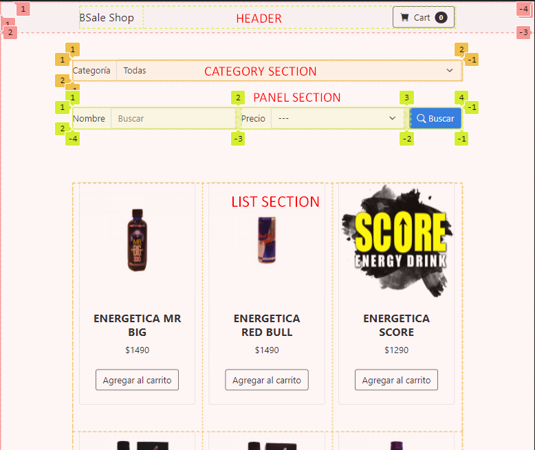

# Detalle Frontend

## Tecnologías requeridas

- HTML
- CSS
- JAVASCRIPT
- Start Bootstrap - Shop Homepage v5.0.4 (template de Bootstrap para una tienda online). Incluye los estilos de Bootstrap v5.1.3 además de modificaciones. https://startbootstrap.com/template/shop-homepage. Incluido en los archivos del proyecto.
- Bootstrap icons v1.5.0 (https://icons.getbootstrap.com/). Liberia de Iconos de Bootstrap. Requerido desde una CDN en el HEAD del HTML (https://cdn.jsdelivr.net/npm/bootstrap-icons@1.5.0/font/bootstrap-icons.css).

## Organización

```
frontend/
├──assets/    Imágenes del proyecto
├──css/
│   └──styles.css   Estilos del proyecto que incluyen el template
├──js/
│   ├──schemas/    Clases de javascript para el paso de datos
│   ├──modules/    Funciones de javascript que encapsulan operaciones del frontend
│   └──scripts.js    Archivo principal de javascript
└──index.html
```

## Layout



## Módulos

Este proyecto tiene 2 módulos:

- categories.js: Módulo para la gestión de las categorías obtenidas de la api. Dentro se tiene una función para obtener las categorías.
  - paintCategories(): Función que pinta las categorías traídas de la api en un elemento del DOM.
- products.js: Módulo para la gestión de los productos obtenidos de la api. Se tienen las funciones:
  - paintProductByCategory(): Función que pinta los productos de una categoría en un elemento del DOM.
  - paintProductBySearch(): Función que pinta los productos de una búsqueda en un elemento del DOM.

## Despliegue

Los archivos del frontend no son empaquetados. El frontend es desplegado en el backend.
