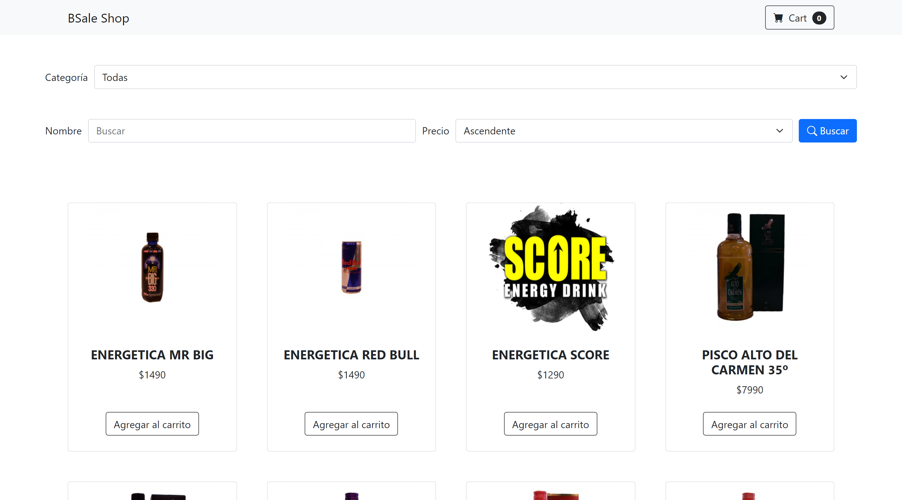

# BSale Test

Carrito de compras con Javascript Vanilla en Frontend y backend con Node.js/MySQL

[Ver la App en producción](https://bsale-store-xsr.herokuapp.com/)

## Como ejecutar el proyecto

### Variables de entorno requeridas

- DB_HOST: Host de la base de datos
- DB_USER: Usuario de la base de datos
- DB_PASS: Contraseña de la base de datos
- DB_DATABASE: Nombre de la base de datos

  Dentro de la carpeta `backend` se ubica un archivo .env.example como ejemplo del archivo .env que puede crearse en dicha carpeta para ejecuciones en entorno de desarrollo

### Scripts del proyecto

- `npm install` para instalar las dependencias
- `npm run dev` para ejecutar proyecto en modo desarrollo (nodemon)
- `npm start` para ejecutar el proyecto en modo produción

# Entorno de desarrollo

- Windows 10
- Visual Studio Code v1.64.2 + extensiones [extensiones recomendadas](.vscode/extensions.json)
- Chrome Browser v98.0.4758.102
- Node.js v16.13.1
- npm v8.1.2
- nodemon v2.0.15

## Explicación del ejercicio

[Explicación del ejercicio](docs/exercise.md)

## Detalle Frontend

[Frontend](docs/frontend.md)

## Detalle API REST

[API REST](docs/api-rest.md)

## Licencia

MIT

## Enlaces de interés para el proyecto

- https://www.npmjs.com/package/yup
- https://www.carlrippon.com/using-lodash-debounce-with-react-and-ts/
- https://github.com/angus-c/just#just-debounce-it
- https://midu.dev/lazy-loading-imagenes-html/
- https://developer.mozilla.org/en-US/docs/Web/Performance/Lazy_loading
